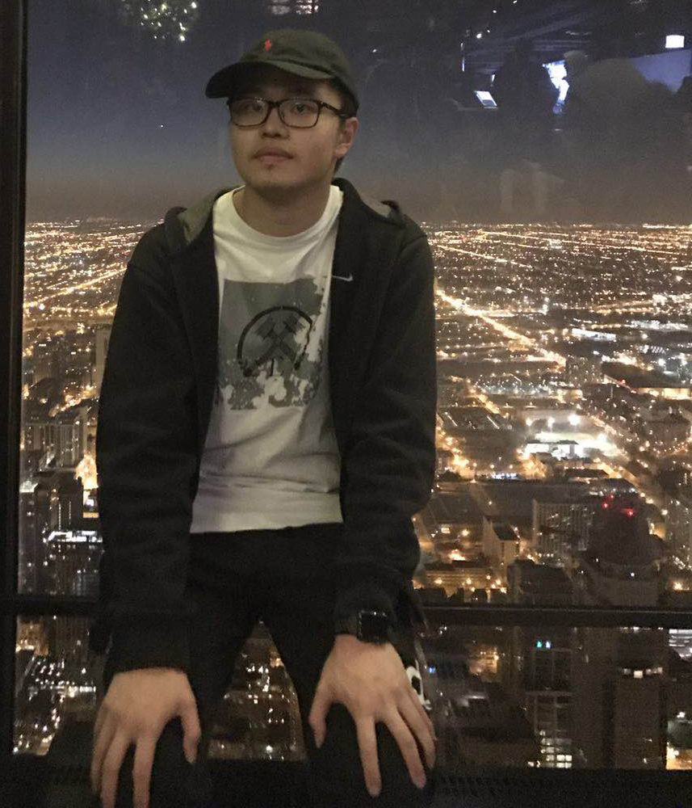
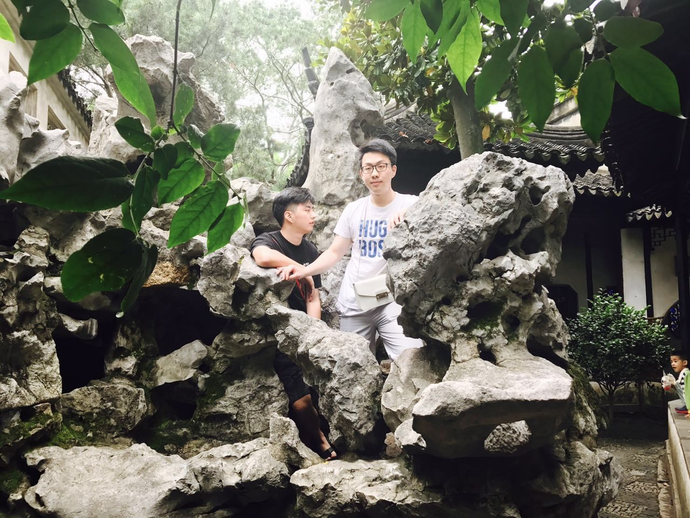

---
title: "Assignment Two - WADDS"
output:
  html_document:
    df_print: paged
---

```{r setup, include=FALSE}
knitr::opts_chunk$set(echo = TRUE)
```

## The Team:


Our Team Name is WADDS, which consists of the first letters of each of our names. Our goal for this semester is to learn how to use R to solve problems in a data science team setting. We hope to learn how to effectively communicate results and processes so we can analyze the world around us.

## Sarah Liddle


As for my goals post-graduation go, my dreams consist of two parts: writing and math. In general, I want to write novels and work in data science and statistics. Six months after graduation, I would hope to have a job working with data, though I'm open to what company it's for. Five years later though, I hope to have experience working for a variety of places; I don't want to just stay stuck in the first job I get. I want to explore different locations, companies, projects, etc. and use data science to learn about many different facets of our world that I've never explored before. On the writing side, I hope to be writing and publishing books in my free time--something along the style of Annie Dillard meets Stephen King, if such a thing could possibly exist. 

This leads me to one question I would like to know the answer to that could be answered by analyzing data: are there any significant patterns in traits of people who historically read more horror novels? It could be an interesting way to find out more about audiences I may be writing towards in the future. 

Thinking more in the long run about my goals, I admit that I don't know the full potential of what I could do with data science, or what my greatest career accomplishment could be. I feel there's so much unexplored territory that there is potential to use data to give a company information to make very great change in the world, and I hope I can be a part of that. 

Given these goals, I hope to get all the essential tools for data science in this course that will be readily applicable to the real world. I have relatively little experience, and I'm hoping by the end of the course I feel confident in my ability to turn large data sets into knowledge that can be used. 

And as for something that's not included in the questions, I love animals. I have two dogs and two cats at home where I grew up, and my roommates and I just adopted a kitten this summer names Pants. Below, is a picture of one of my dogs, Max.


### Feedback

#### Abby

You were easy and enjoyable to work with and efficiently did your share of the assignment. Your individual portion was interesting and concise. My only suggestion would be to make the first sentence of your career accomplishment paragraph more clearly worded. 

#### Derek

It was easy to work with you, and you completed your part of the assignment by our group's decided time. Your individual portion was clear and to-the-point. The answers to the questions about what you want to be doing in the future threw me off slightly, but I enjoyed the satirical tone. 

#### Will

You contributed your portion to the assignment and were easy to work with. I liked how you expressed your excitement when talking about your goals. There were minor typos and grammar issues, and it might be helpful to clarify what "the question" section refers to. 

#### David

You were also good to work with and did your share in a timely manner. It was cool to see how all your goals related to different aspects of statistics. Some answers could benefit from a little editing for wording and grammatical issues, but other than that, it is straightforward and interesting. 


## Abby Nay


One question I would like to know the answer to that could be answered by analyzing data: is a carbon tax the most effective way to combat anthropogenic climate change?

Six months after graduation I would like to be working at a bigger company such as HP or Intel, who offer student loan repayment assistance. I would like to be close to paying off my debts the six months immediately following graduation. Five years after that I would like to be working in research that can make a positive impact on the world. I would love to be paid to analyze data related to climate change, poverty programs, or human rights campaigns across the world.

I hope my greatest career accomplishment will be in the research I hope to be a part of later in life. If I can find a significant way to protect the environment I would consider that my greatest accomplishment. I aim to use data to successfully argue for worldwide change.

In this course I'm hoping to gain skills to become a better data scientist. I hope to build a solid foundation in R and R Studio and am excited to learn more about interpreting data without being misleading. I also hope to be part of a successful team in this class, where we can all grow our skills and learn about how to effectively collaborate in business and research conditions.

My hobbies include paddleboarding, hiking, ice skating, tennis, and organizing. In fact, if I didn't love Statistics as much as I do, I would be going to school for psychology in order to become a professional organizer.

### Feedback

#### Sarah: 
  I really appreciated how you came to our group meeting on time and prepared. It was so helpful to the team when you already knew how to add a picture and were able to teach that to all of us as well! Everyone could generally use more practice with Github and editing the master document at the same time as everyone else.

#### Derek: 
  You showed up to our group meeting on time, with your individual part already done. You had a great understanding of Github and Gitkraken which was very helpful to all of us. Everyone could generally use more practice with Github and editing the master document at the same time as everyone else.

#### David: 
  We all appreciated how you showed up to our meeting on time and had everything prepared for merging like we had planned. We saved a lot of time meeting since you came ready with everything. Everyone could generally use more practice with Github and editing the master document at the same time as everyone else.

#### Will: 
  Our meeting was short and efficient, in large part because you came prepared and on time. Since you had your written portion completed we were easily able to add it to the master like we did with everyone else. Everyone could generally use more practice with Github and editing the master document at the same time as everyone else.

##Derek Thomas


####A question I would like to know the answer to that could be answered by analyzing data?

Is there an easy and objective way to distinguish fake news and propaganda from factual journalism?

#### What would I love to be doing six months after graduation?
Performing services in exchange for currency  
(real answer: getting a masters in machine learning, the level at which I would like to work in this field requires at least a masters,... maybe a PhD.)

####What would I love to be doing 5 years after that?
Performing comparable services in exchange for more currency  
(real answer: I would love to be working at a machine learning startup, and I am planning on doing the entrepreneurial senior captione in a few years)

####What you hope your greatest career accomplishment will be? 
Contributing in a non-negligible way to the development of AGI (Artificial General Intelligence)

####What am I hoping to learn in this course?
Useful data science and collaboration skills 

####What is something else about me?
I am an excellent cook.

### Feedback:
Everyone showed up to the group meeting on time, prepared and enthusiastic.

#### Abbey:
You took the first steps to merging our individual responses into a single document.

#### David
I am glad you are also interested in machine learing, we should get together and talk about it sometime, maybe we can apply it to one of the projects we do in this course.

#### Sarah
You figured out how to embed pictures in the the knitted R document.

#### Will
You persisted through all the issues with gitkraken, also we should talk about finance sometime, one of my interests is applying machine learning for financial applications.

##David Du



At least one (non-statistics) question you would like to know the answer to that could be answered by analyzing data

How did you hear from our restaurant? 
How long have you used our products/services?

What you would love to be doing six months after graduation and then five years after that (what would make you excited to be doing?)

Six month after graduation, I plan to attend graduate school and I will be majoring statistics, during this time, I should have finished 1st semester graduate study. I also have some understanding about statistics (at least for some programming skills in R). After five years, I should finish my graduate study and work in the company. In the future, I plan to do some work relate to statistics and apply my knowledge into real life, help people solve problems.

What you hope your greatest career accomplishment will be and given these hopes and goals, what you are hoping to learn/accomplish/do in this course

I hope to use my statistics knowledge and programming skills to get my jobs and applying knowledge into real world. Based on aim, I would need to learn basic programming skills and try to solve problems from small areas. R could be one of the most important tools in analyzing and cooperating data in different area. Therefore, I want to learn R in this course.

You must also include something of your own choosing not described above. Anything. Be creative!

If I become a statistician, I would like to establish some statistics lab in all parts of the world, and help them in different areas based knowledge of statistics.

### Feedback:

#### Sarah: 
  I really love dogs and I also have dogs in my home and I also love reading novel􀀏 and I hope for some day I can
read novel written by you

#### Will: 
  I am very surprised that you have the same goal with me and I also curious about the graduate rate for math students in
four years because it􀅇s actually a difficult major. The only thing I think need to prove is some grammar problem.

#### Derek: 
  Machine Learning is a very cool area and it is actually being used a lot now. I really love it. I could also consider it as an option for my future career development.

#### Abby: 
  Environment is definitely a very important problem in the real world and I hope you can think about an effective way to
protect the environment.


## Xinzhi "Will" Rao



#### What you would love to be doing six months after graduation and then five years after that

 After six months from graduating, I am going to be a graduate student major in statistics or data science, which just starts the first semester. I hope I could take many statistics class and do the project with my partners. After five years, I'm very excited to be a data scientist by collecting data, analyzing data and using my data science skills connected to the real problem.

#### What my greatest career accomplishment will be?
 I hope I could be the chief data scientist in a IT company. I could manage and study the core data in the company. 

 In this class, I hope to learn more about R programming language and use R to do the project with statistical problem. For this class, my goal is improving my both statistical and programming skills. 

#### The Question

 I'm curious about the rates for university students could graduate in 4 years with major in math in the US.

#### More about me
 I'm also very interested in finance, and I'm also trying to use the statistical and data science skills in doing financial work. By the way, I very much enjoy fried chicken in US especially "Popeyes".

### Feedback
#### Sarah: 
  I am very interested in reading scientific novels, and I hope one day we can read the novels that you write. By the way, your dog is pretty cute, and I also have one dog in my home.

#### Du: 
  I'm very gald to see that you have nearly the same goals as mine after graduation. I also want to establish some statistics labs based around helping other people learn statistics. Maybe we can do it together.

#### Derek: 
  It seems like you are very interested in machine learning, which I do not know much about. I love cooking and I can prepare many different kinds of Chinese dishes.

#### Abby: 
  Your hobbies are very attractive to me and I am also playing ice skating. Protecting environment now plays an important part in this world. I hope you could find an effective way to protect environment.

