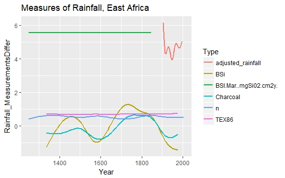

```{r setup, include=FALSE}
knitr::opts_chunk$set(echo = TRUE)
library(tidyverse)
shelter_data33 <- read_csv("aac_shelter_outcomes.csv")
```
##Team Part:
An overall question we would like to investigate in next weeks lab is: what trends are there in animals leaving and entering a humane society and what factors lead to more animals getting adopted?

For our domain expert, we are going to be doing this research for the Austin Animal Shelter in Texas. By analyzing their data, we can help them to determine what factors lead to higher rates of adoption of their animals. We can also see which factors may be applicable to other animal shelters across the country. By discovering the trends present in this data set they will be able to change policy and practices to hopefully increase adoption rates and possibly decrease instances of euthanasia.

The data we will use to answer our questions is a dataset from Kaggle that gives information about thousands of animals admitted to the Austin Animal Center Shelter. The data set describes each animal with details including its age, gender, and condition, and outcome of the animal. This dataset can be found at the following URL: https://www.kaggle.com/aaronschlegel/austin-animal-center-shelter-outcomes-and 

```{r doinit}
shelterdata3<-select(shelter_data33, -animal_id, -color, -monthyear, -name, -X13, -X14, -X15, -X16, -X17, -X18)
shelterdata3<- shelterdata3 %>% separate(sex_upon_outcome, into=c("Status","Sex"),sep=" ", fill="left")
shelterdata3<- shelterdata3 %>% separate(datetime, into=c("Year","Month"),sep="-",extra="drop")
shelterdata3<-shelterdata3[-31,]
shelterdata3$Year<-parse_integer(shelterdata3$Year)
shelterdata3$Month<-parse_integer(shelterdata3$Month)
shelterdata4<-as.tibble(select(shelterdata3, age_upon_outcome,animal_type,outcome_type,Sex))
testing6<-as.tibble(filter(shelterdata4,age_upon_outcome!="NULL",outcome_type!="Died",outcome_type!="Missing",outcome_type!="Rto-Adopt",outcome_type!="NA"))

testing7<-testing6%>%
  separate(age_upon_outcome,c("age_num","age_unit")," ")
testing8<-as.tibble(filter(testing7,age_unit!="day",age_unit!="days",age_unit!="month",age_unit!="week",age_unit!="year",age_unit!="weeks"))
testing9<-as.tibble(filter(testing8,outcome_type=="Adoption"))
ggplot(data = testing9,mapping=aes(x=animal_type),na.rm=TRUE)+geom_bar()+facet_wrap(~age_unit)
```
As we can see from the plot above, one of the major factors influencing adoption rates is age, dependent on species. For cats, there are more adoptions when they are younger, while there are conversely more adoptions for older dogs. This could be due to the fact that older dogs are more likely to be perceived as mild, and could have been trained by previous owners to be well-behaved. Since cats tend to wander outside and mate, there could be a correlation between young cats and adoption simply because there may be more young cats born on the street that become strays. Either way, we see a clear trend to adopt more younger cats and older dogs.

##Enter Cat missing during summer plot here!
In this plot, we found that cats go missing from there home significantly more often in the summer than any other time of year, while the rate of dogs coming to the shelter are relatively constant throughout the year. This can probably be attributed to the fact that people may have windows and doors open more often in their homes during the summer than any other time of year, making it easier for cats to escape and explore beyond their boundaries. This means that every summer, there is generally a larger influx of cats admitted to the animal shelter. The shelter could use this information to make sure they are equipped to handle more cats in the summer than the rest of the year; on the other hand, they can expect to have a relatively consistent number of dogs in the shelter. 

##Enter names being adopted plot here with writeup!


## David

## Questions: 
 * Do different types of animals have different outcomes of entering the shelter, and how do different kinds of animals have different abilities to adapt? 
Since we can investigate this problem from age and sex and different outcomes and give consumers information for what they want to breed.
   
 * Does classifcation of cats help them get better service? 
For example, we could classify different kinds of cat by ages. The cats with younger age could adopt much more quickly than adult cats, and younger cats could have more convenience service than others. For example like therapy 


## Import data into R
```{r, warning=FALSE, message=FALSE}
library(tidyverse)
mydata<-read.csv('aac_shelter_outcomes.csv')
mydata<-mydata[,1:12]
```

## Tidy the data
```{r, warning=FALSE, message=FALSE}
mydata %>%group_by(animal_type,outcome_type)%>%count()
```

## Create and transform variables
```{r, warning=FALSE, message=FALSE}
library(ggplot2)
thedata<-subset(mydata,select =c(age_upon_outcome,animal_type,outcome_type))
thedata<-subset(thedata,thedata$outcome_type!="")
thedata$age_upon_outcome<-as.character(thedata$age_upon_outcome)
thedata$age_type<-(strsplit(thedata$age_upon_outcome," "))
thedata$age_type<-as.character(lapply(thedata$age_type,function(x){unlist(x)[2]}))
cat_data<-subset(thedata,thedata$animal_type=="Cat")
cat_data<-na.omit(cat_data)
```

## Create plots of the variables and relationships between variables or create meaningful summaries of the data
```{r, warning=FALSE, message=FALSE}
ggplot(data=thedata,aes(x=animal_type,fill=factor(outcome_type)))+geom_bar(position="fill")+labs(title = "outcomes of entering the shelter for different types of animals", x = "types of animals", y = "percentage")
```

```{r, warning=FALSE, message=FALSE}
ggplot(data=cat_data,aes(x=age_type,fill=factor(outcome_type)))+geom_bar(position="fill")+labs(title = "outcomes of entering the shelter for different age of cats", x = "types of age", y = "percentage")
```

## Findings
For the first question, we can see that the cat and dog have bigger percentage to be adopt, and the cat has bigger percentage to be adopt in the months of age, also we could find that cat has the smallest percentage to be adopt in the days of the month. Therefore, we need to care more about younger cats. 

##Will
```{r setup2, include=FALSE}
knitr::opts_chunk$set(echo = FALSE)
library(tidyverse)
library(plyr)
shelter_data <- read_csv("aac_shelter_outcomes.csv")
```

My primary concern is how breed of dog/cats will affect the sex_upon_outcome of animals that enter into the Austin Animal center. We are curious about whether the `sex_upon_outcome` has a significant different when `breed` varies.

Then, we will explore which breeds of animals are more likely to enter into the Austin Animal center.

We divide our result as two parts, one deals with dogs and the other deals with cats.

## Dogs in Austin Animal Shelter
```{r Will1}
dog_data <- as.tibble(filter(shelter_data, shelter_data$animal_type == "Dog"))

# Compute the frequency of dogs of particualr breed and `sex_upon_outcome`
dog_result <- count(dog_data, c("breed", "sex_upon_outcome"))

# To see the pattern when the frequncy > 400
dog_result1 <- as.tibble(filter(dog_result, dog_result$freq > 400))

dog_pct <- dog_result1$freq/44242

dog_result1$pecentage <- dog_pct
dog_result1[order(dog_result1$freq),]
```
After running the R script, we find that the Pit Bull Mix is of most often spayed or neutered: 4.82% is spayed female, and 5.32% is neutered.  

```{r Will2}
dog_breed <- count(dog_data, "breed")
dog_breed1 <- as.tibble(filter(dog_breed, dog_breed$freq > 400))
dog_breed1[order(dog_breed1$freq),]
```

From the analysis above, we find that Pit Bull Mix, Chihuahua Shorthair Mix and Labrador Retriever Mix are among the most breeds in the Austin Animal center.

## Cats in Austin Animal shelter
For cats,
```{r Will3}
cat_data <- as.tibble(filter(shelter_data, shelter_data$animal_type == "Cat"))
cat_result <- count(cat_data, c("breed", "sex_upon_outcome"))
cat_result1 <- as.tibble(filter(cat_result, cat_result$freq > 400))
cat_result1[order(cat_result$freq),]
```
Again, we find that the cat Domestic Shorthair Mix are among the most neutered or spayed.

```{r Will4}
cat_breed <- count(cat_data, "breed")
cat_breed1 <- filter(cat_breed, cat_breed$freq > 100)
cat_breed1[order(cat_breed1$freq),]
```
From the analysis above, we know that Domestic Shorthair Mix, Domestic Medium Hair Mix and American Shorthair Mix are most adopted in the center.

## Conclusion 
We find that Pit Bull Mix and Domestic shorthair Mix are adopted by the Austin Animal Center mostly. And they are spayed or neutered more than other breeds. Dogs and cats are our friends, they are cute. Everyone that has pets with dogs/cats to treat their pets wisely.

## Sarah
```{r setup3, include=FALSE,warning=FALSE}
knitr::opts_chunk$set(echo = FALSE)
library(tidyverse)
shelter_data <- read_csv("aac_shelter_outcomes.csv")
```

## Sarah Individual

### Tidying the Data

To begin tidying the data, I first removed columns I didn't feel were necessary for our analysis, including variables like the animal ID and the name of the animal. I then separated the sex and status of whether the animal is neutered or not from one column to two. I then made the datetime column more useful by only including the month and the year and separting the two so that they could be examined separately. The code I used to tidy the data can be found below:  

``` {r tidy1sarah, warning=FALSE, echo=TRUE}
shelterdata1<-select(shelter_data, -animal_id, -color, -monthyear, -name, -X13, -X14, -X15, -X16, -X17, -X18)
shelterdata1<- shelterdata1 %>% separate(sex_upon_outcome, into=c("Status","Sex"),sep=" ", fill="left")
shelterdata1<- shelterdata1 %>% separate(datetime, into=c("Year","Month"),sep="-",extra="drop")
shelterdata1<-shelterdata1[-31,]
shelterdata1$Year<-parse_integer(shelterdata1$Year)
shelterdata1$Month<-parse_integer(shelterdata1$Month)
```

### Findings

I began by investigating different patterns between years at the animal shelter. First, I analyzed the spread of animals through various years in regards to their spayed and neutered status. The spread seems to have remained constant over the past few years, though it is interesting to note that the number of total animals reported increased significantly between 2013 and 2015. This suggests that the animal shelter has expanded and has made changes that allow them to take in more animals

``` {r sarahfindings}
ggplot(data=shelterdata1)+geom_bar(aes(x=Year, fill=Status))
```

Next, I examined patterns in the various outcomes between each type of animal for each year in the dataset. The first plot shows the outcome type per year, and the second shows the outcome subtype. While many of the outcomes seem to be relatively constant throughout the years, some things that stand out are that there is a massive spike in rto-adoptions for dogs in 2017. The animal might want to examine what changes occurred in 2017 that caused this and continue it in the following years to initiate more rto-adoptions. A similar spike occurs in cats for the same year, though not as large. 

``` {r findings2}
ggplot(data=shelterdata1)+geom_density(aes(x=Year, fill=outcome_type),alpha=0.9)+facet_wrap(~animal_type)
ggplot(data=shelterdata1)+geom_density(aes(x=Year, fill=outcome_subtype),alpha=0.9)+facet_wrap(~animal_type)
```

Finally, I examined patterns between months for different types of outcomes in different animals. The most notable trend amongst all this is that there seems to be a pattern between birds, cats, and dogs of larger amount of disposal in the beginning of the year.Overall, the transfer program and adoption rates seem consistent on a monthly basis, so the shelter seems to be doing a good job with that.

``` {r findings3}
ggplot(data=shelterdata1)+geom_density(aes(x=Month, fill=outcome_type),alpha=0.9)+facet_wrap(~animal_type)
#ggplot(data=shelterdata1)+geom_density(aes(x=Year, fill=animal_type),alpha=0.9)+facet_wrap(~outcome_type)

```

## Abby
To analyze our overall question of which factors lead to animals being more or less likely to be adopted, I decided to analyze how age affects adoption rates. If we can identify patterns about what aged animals are more and less likely to be adopted, then we can make broader conclusions about the factors that influence both adoption rates, and the likely outcome of an animal coming into the shelter.

```{r Abby1}
shelterdata2<-as.tibble(select(shelterdata1, age_upon_outcome,animal_type,outcome_type,Sex))

testing1<-as.tibble(filter(shelterdata2,age_upon_outcome!="NULL",outcome_type!="Died",outcome_type!="Missing",outcome_type!="Rto-Adopt",outcome_type!="NA"))

testing2<-testing1%>%
  separate(age_upon_outcome,c("age_num","age_unit")," ")
testing3<-as.tibble(filter(testing2,age_unit!="day",age_unit!="days",age_unit!="month",age_unit!="week",age_unit!="year"))
testing4<-as.tibble(filter(testing3,outcome_type=="Adoption"))
ggplot(data = testing4,mapping=aes(x=animal_type),na.rm=TRUE)+geom_bar()+facet_wrap(~age_unit)
```
First, I seperated the age_upon_outcome column to be able to separate among the age levesl of weeks, months, and years. There seems to be an interesting trend among the adoption levels of animal species among the different age categories. For example, among all animal types none were adopted when they were less than 1 month old. Among birds, there were roughly equal amounts of adoptions among months old and years old birds. Among Other types there was a slightly larger amount of animals being adopted at months old and not years old. There was an increase in adoption of older Dogs compared with younger dogs. While there seemed to be a decrease in adoption of cats as they were older.

This implies that among animals entering shelters, they would be more likely to be adopted younger if they are cats, while they are more likely to be adopted older if they are dogs. We can also analyze to see the general trends among species in outcomes.

```{r Abby2}
ggplot(data=testing3,mapping=aes(x=animal_type,y=outcome_type))+geom_count()
```
From the plot above we can see that among birds, there is no trend in outcome. Thus for birds we cannot make accurate predictions on their eventual outcomes once they have entered a shelter. Among Cats, their likely outcomes upon entering the shelter are being adopted followed by transfering to a new shelter. Dogs are most likely to be adopted, followed by being returned to their owners, and then being transfered. Livestock only seem to be transfered or adopted, but never euthanized. Other types of animals are most likely to be euthanized. This illustrates that species is a big factor in the eventual outcome of the animal entering into the shelter. 

## Summary of Individual Contribution

Sarah: In order to tidy the dataset, I primarily used select separate, and the parse function. I used these to select important columns, break up columns into multiple variables, and turn them into a type that would be useful to use. I plotted many different variables in the dataset over different years and months to look for patterns amongst them so the shelter might be able to reflect on what they did in those years or months that would have caused these patterns, particularly among the outcomes of animals. 

David: In this report, I firstly count the number of the different animals with the different outcomes using group_by and count in tidyverse. Then we select variables and we use and transform the age variables to category variables including day,days,month,months,week,weeks,year,years to represent the different age. Finally we create plots of the variables to answer the question.

Abby: I tidied some of the data Sarah had previously tidied in order to do my analysis. I primarly did this through separate in order to get an age group column to use in my comparisons. I then created a plot to show the adoption counts for each animal type among the different age groups. This allowed me to see how age affected the adoption rates of different species. Finally, I created a plot showing the counts of different outcomes for each animal species. This allowed me to draw more conclusions about the likely outcome of an animal when they first enter the shelter. 

##East Africa Lake Dataset


From the graph above we can see that, on average, rainfall has decrease for the variables rainfall, charcoal, and BSi. However, for the variables BSi.mar, n, and TEX86 there seems to have been neither an increase nor a decrease in the rainfall. The variable for average rainfall seems to fluctuate, but has generally been decreasing, as the years increase.